# AI Product Discovery Copilot Flow Chart

This document shows the current end-to-end workflow for the async AI Product Discovery Copilot, including the Custom GPT interaction loop, backend analysis pipeline, artifact generation, and evidence retrieval path.

## 1. End-to-End Workflow

```mermaid
flowchart TD
    U[User submits research request] --> G0[Custom GPT / Agent 0]

    G0 --> D0[Infer draft brief from prompt]
    D0 --> B1{Are all required brief fields locked?}

    B1 -- No --> Q1[Ask user follow-up questions]
    Q1 --> L1[Update locked brief]
    L1 --> B1

    B1 -- Yes --> C0[Show full locked brief]
    C0 --> C1{User said go ahead?}
    C1 -- No --> C2[Apply user edits]
    C2 --> C0
    C1 -- Yes --> A1[POST /analyze-feedback/start]
    A1 --> R1[Backend validates request]
    R1 --> R2[Create run_id and queued status]
    R2 --> R3[Return run_id, status, ETA minutes]

    R3 --> G1[GPT reads run_id and ETA]
    G1 --> P1[GET /runs/{run_id}/status?wait_seconds=35]
    P1 --> B2{Run completed?}

    B2 -- No --> G2[GPT tells user analysis is still processing and shares conservative ETA in minutes]
    G2 --> U2[User comes back later]
    U2 --> P2[GET /runs/latest/status or GET /runs/{run_id}/status]
    P2 --> B3{Run completed now?}
    B3 -- No --> G2
    B3 -- Yes --> M1[GET /runs/{run_id}/manifest]

    B2 -- Yes --> M1

    M1 --> C1[Read compact_gpt_payload.json first]
    C1 --> E1[Retrieve required evidence artifacts]
    E1 --> S1[GPT answers research questions]
    S1 --> S2[GPT synthesizes segments, JTBDs, needs, pains, contradictions, repeat-listening analysis]
    S2 --> S3[GPT ranks opportunities using evidence artifacts]
    S3 --> S4[GPT writes final Markdown report in chat]
    S4 --> U3[User receives downloadable Markdown-style output in chat]
```

## 2. Brief Locking Flow

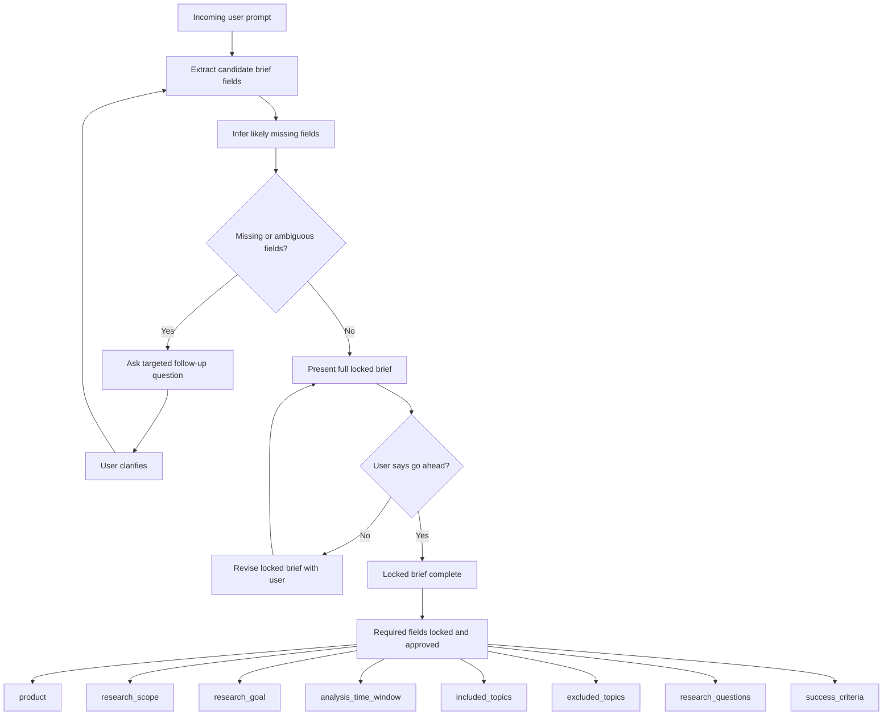

## 3. Async Backend Run Flow

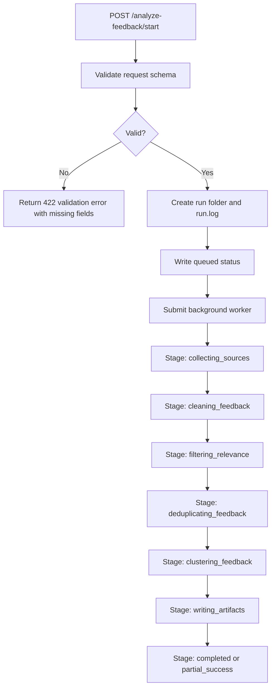

## 4. Source Collection Flow

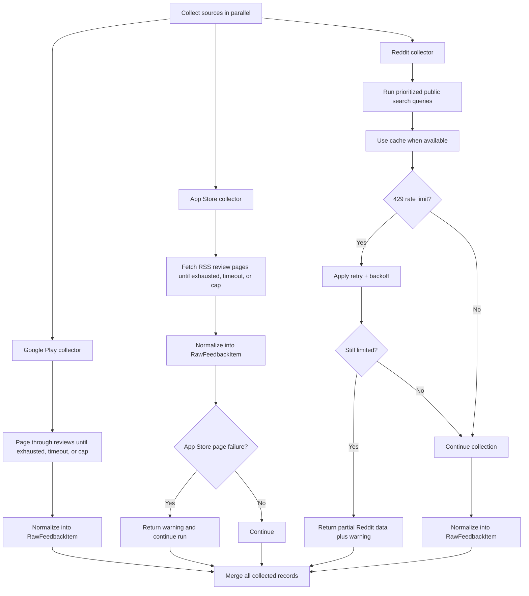

## 5. Processing Pipeline Flow

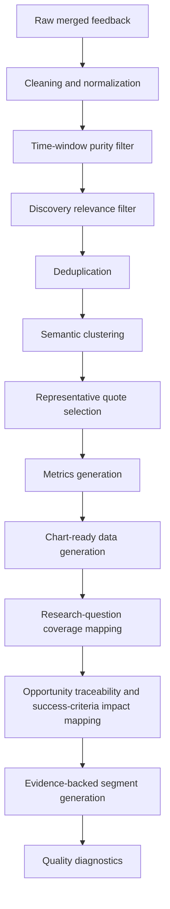

## 6. Clustering Logic Flow

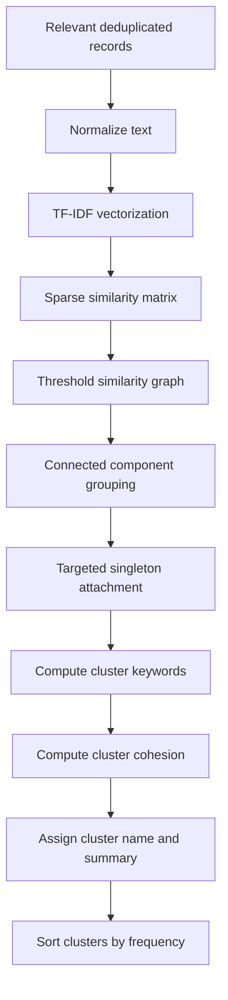

## 7. Artifact Generation Flow

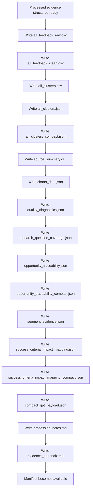

## 8. GPT Evidence Retrieval Flow

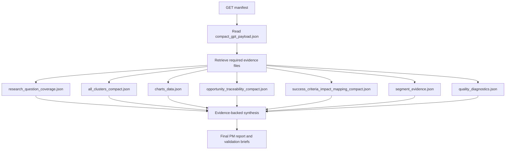

## 9. Failure and Fallback Flow

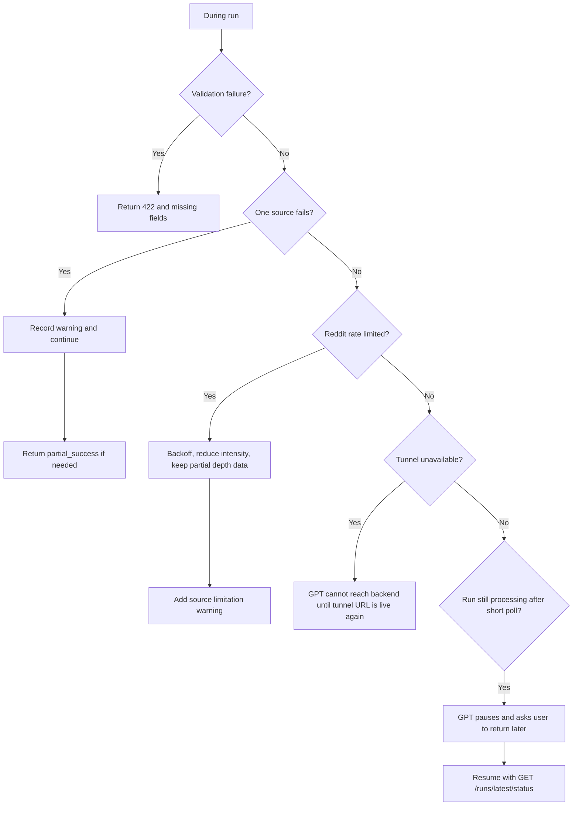

## 10. Key Design Principles Captured by the Flow

- Backend prepares evidence; GPT performs PM reasoning.
- GPT must not call the backend until the full brief is locked.
- GPT must not rank opportunities using compact payload alone.
- Compact payload is the summary layer; artifacts are the deep evidence layer.
- Reddit is treated as a qualitative depth source, not the primary scale source.
- Partial source failures should degrade gracefully, not fail the full run.
- Async execution avoids single-call GPT timeout pressure.
- Final report is returned directly in chat as downloadable Markdown-style output.

## 11. Non-Technical High-Level Version

This version is meant for product, ops, or stakeholder review.

### 11.1 What The AI Does vs What The Backend Does

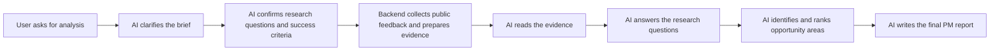

### 11.2 Backend Responsibilities

The backend script is responsible for the evidence pipeline only.

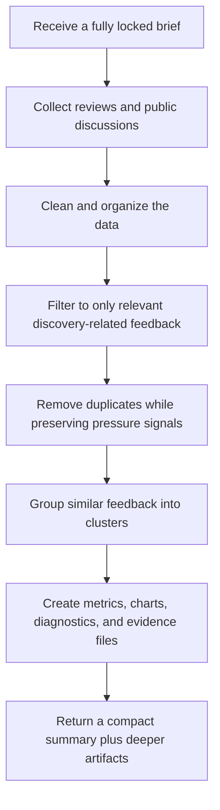

### 11.3 AI Responsibilities

The AI is responsible for reasoning, interpretation, and report generation.

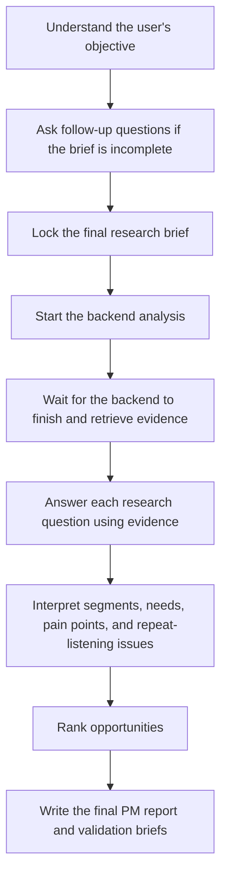

### 11.4 Simple End-to-End Story

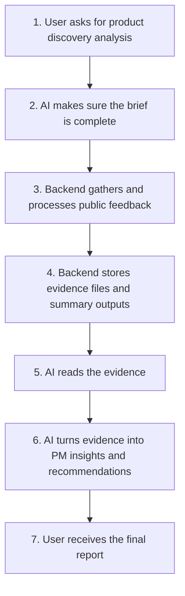

### 11.5 Plain-English Summary

- The backend acts like the research operations engine. It gathers, cleans, filters, groups, and measures the feedback.
- The AI acts like the product researcher. It interprets the prepared evidence, answers the research questions, and writes the final report.
- The backend does not decide the PM strategy or recommendations on its own.
- The AI does not invent evidence on its own. It must use what the backend prepared.
